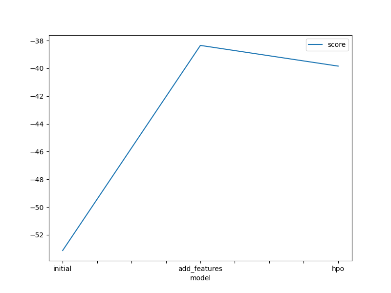
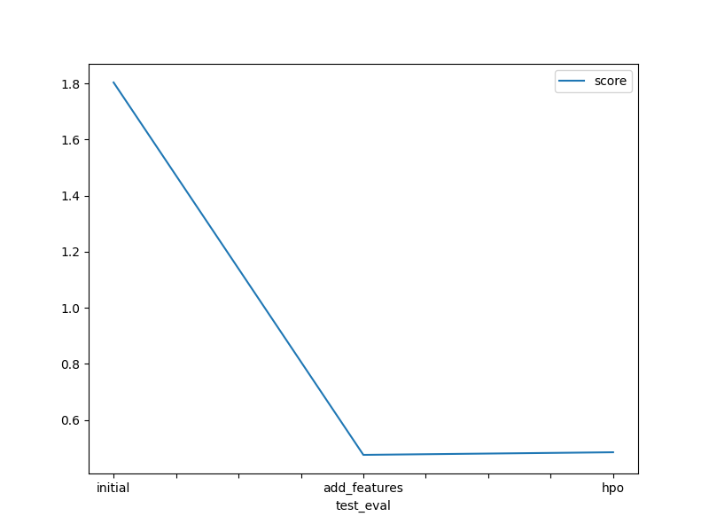

# Report: Predict Bike Sharing Demand with AutoGluon Solution
#### Pei-Hsin Wang

## Initial Training
### What did you realize when you tried to submit your predictions? What changes were needed to the output of the predictor to submit your results?
When submitting predictions, I realized that negative values for bike demand were not acceptable, leading to automatic rejection of the submission. To ensure valid results, I adjusted any negative predictions to zero before submission, aligning with the real-world scenario where bike rentals cannot be negative.

### What was the top ranked model that performed?
'WeightedEnsemble_L3' was the the best model. It combined the strengths of various individual models to achieve the best preformance in predicting bike sharing demand.

## Exploratory data analysis and feature creation
### What did the exploratory analysis find and how did you add additional features?
Exploratory data analysis provided insights into overall trends and key features influencing bike demand, helping to interpret patterns crucial for forecasting.

Insights:

1. Average Bike Rentals per Month:
    - The trend shows higher bike rentals during the warmer months (May through October) and lower rentals during colder months (November through April), consistent across both years. This indicates a clear seasonal pattern that can be crucial for planning and forecasting.

2. Average Bike Rentals by Hour of the Day:
    - There are peak rental times at around 8 AM and 5 PM, corresponding to typical commuting hours. The low rental activity in the early morning hours indicates minimal usage during late-night hours.

3. Average Bike Rentals by Day of the Week:
    - Bike rentals are generally higher on weekdays compared to weekends. This pattern may be due to the use of bikes for commuting during workdays.
    
4. Weather Distribution:
    - Most of the data is recorded during clear weather (Weather 1). The frequency decreases with worsening weather conditions, with very few data points recorded during heavy rain/snow (Weather 4).

  
  

5. There are 1 outlier and 227 outliers found in humidity and windspeed observations. Investigating outliers across time, indicating that they are not isolated to specific periods but rather scattered across different dates. 

 

6. There are two pairs of high correlation features: `season`-`month` and `temp`-`atemp`, which are aligning with common sense.

After Exploratory Data Anlaysis (EDA), I have:
- **Feature Reduction**: Dropped `atemp` due to its high correlation with temp, as both variables measure temperature.
- **Outlier Removal**: Excluded outliers in the `humidity` and `windspeed` data, which potentially represented inaccurate measurements or extreme conditions. This removed 248 datapoints from the original 10,886, leaving 10,638. These changes aim to enhance model reliability and generalization by focusing on more typical data conditions.
- **Transform Date**: Transforming datetime into new categorical features: 'year', 'month', and 'hour'.
- **Create Dummy Data**: Convert categorical data into dummy columns that returns 47 columns in total features.

### How much better did your model perform after adding additional features and why do you think that is?
The model's performance improved significantly, almost halving the error. This improvement is attributed to the additional granular features like (`year`, `month`, `hour`), which allowed the model to better capture peak and off-peak demand times, aligning with commuting patterns.

## Hyper parameter tuning
### How much better did your model perform after trying different hyper parameters?
Despite forcusing on tuning the top-performing models, the hyperparameter-tuned modle slightly lagged behind the initial top model. This indicates that the initial settings were already well-optimized. Also, choosing hyperparameter requires more domain knowledge and experience.

### If you were given more time with this dataset, where do you think you would spend more time?
If given more time, I would focus on experimenting more extensive tuning with a broader range of hyperparameters and model ensembling techniques (like stacking and bagging) to better understand how these affect model performance.

### Create a table with the models you ran, the hyperparameters modified, and the kaggle score.
|model|Number of Training Data Points|Number of Features|Number of Bag Folds|CatBoost(CAT)|LightGBM(GBM)|
|--|--|--|--|--|--|
|initial|10886||10|8|auto|auto|
|add_features|10638|47|8|auto|auto|
|hpo|10638|47|12|customized|customized|

### Create a line plot showing the top model score for the three (or more) training runs during the project.

### Create a line plot showing the top kaggle score for the three (or more) prediction submissions during the project.

## Summary
In summary, this project has explored building models using three approaches: 1) a model with raw features, 2) a model with feature engineering, and 3) a model with feature engineering and hyperparameter tuning. I found that AutoGluon's auto-configuration is exceptionally powerful. Given a clean dataset with detailed features, AutoGluon can automatically train and identify the best model, significantly reducing the effort required to build and evaluate models. This automation not only enhances efficiency but also lowers the barrier for working on machine learning solutions.
